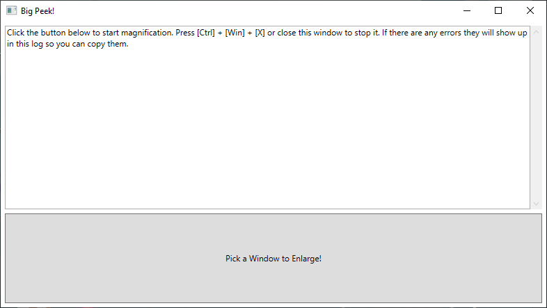

# Big Peek!

Use this tool to zoom a Windows app to full screen.

This app uses the Windows API's magnification feature, the same thing the built-in Magnifier app uses. However it can set a more precise magnification level and affix the magnified area around the selected window. This provides an optimal viewing experience when interacting with old software that only supports small resolutions that modern monitors struggle with. As long as the software you want to magnify supports windowed mode, you can zoom in just around the window. If you want to get rid of the window border, use a separate tool such as [Borderless Gaming](https://store.steampowered.com/app/388080/Borderless_Gaming/).

If you are done using it, close the app or press <kbd>Ctrl</kbd> + <kbd>Win</kbd> + <kbd>X</kbd> to unzoom.